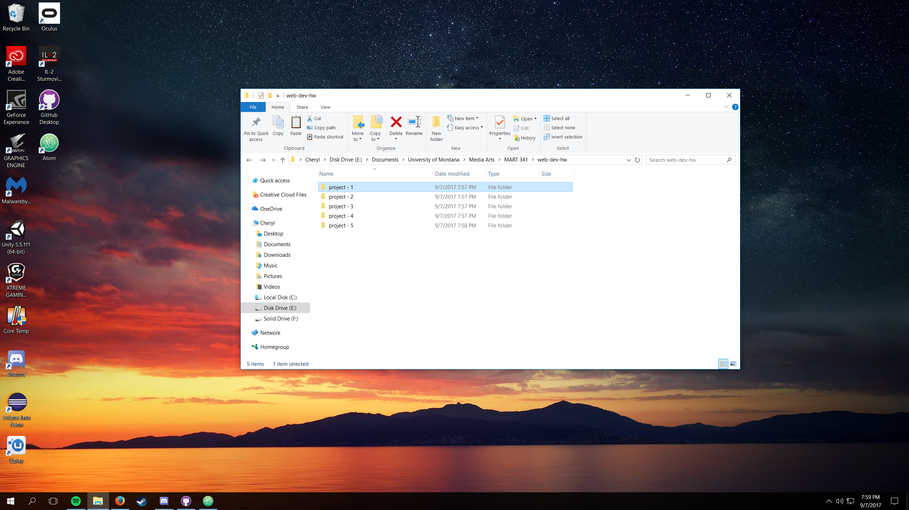

## Grant Ligo
---
**MART 341**

*The class so far,*
It's been some time since I've used html and atom so this is kind of a refresher for me.
---

- list item 1
- list item 2


1. List item 1
2. List item 2

```markdown
This is a code block.
It is written in Markdown.
```
[Cats](http://cats.com/)


